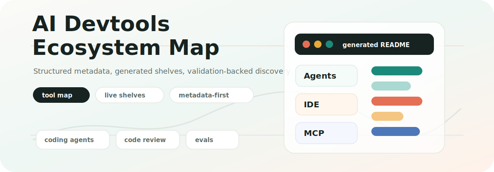

<!-- GENERATED FILE: edit data/tools.yml, data/categories.yml, data/tags.yml, then run npm run generate. -->

# Awesome AI Devtools

<p align="center"></p>

<p align="center"><strong>The open-source map of the AI developer tooling ecosystem.</strong></p>

<p align="center">Window-shop coding agents, IDE assistants, MCP tooling, evals, observability, security, and self-hosted AI dev stacks.</p>

<p align="center"><code>119 tools</code> <code>16 active shelves</code> <code>metadata-first</code> <code>generated README</code></p>

## Why this exists

AI developer tooling changes quickly. This directory keeps entries in structured metadata so the public view can stay polished while the data remains sortable, reviewable, and validation-backed.

No rankings. No launch hype. Just a clean storefront for discovering tools worth a closer look.

## Storefront

| Shelf | What you will find | Tools |
| --- | --- | ---: |
| [Coding agents](#coding-agents) | Agentic tools that can inspect, modify, and reason about source code. | 25 |
| [Terminal agents](#terminal-agents) | AI developer tools primarily operated from a command-line interface. | 12 |
| [IDE assistants](#ide-assistants) | AI assistants embedded in editors or IDEs for coding workflows. | 17 |
| [Browser agents](#browser-agents) | Tools that can inspect, drive, or test browser-based developer workflows. | 1 |
| [MCP servers](#mcp-servers) | Model Context Protocol servers that expose tools, resources, or prompts. | 15 |
| [MCP clients](#mcp-clients) | Applications and agents that connect to Model Context Protocol servers. | 6 |
| [MCP tooling](#mcp-tooling) | Developer tools for building, testing, debugging, or managing MCP systems. | 1 |
| [Agent skill packs](#agent-skill-packs) | Reusable instruction, workflow, or capability packs for coding agents. | 31 |
| [Agent observability](#agent-observability) | Tools for tracing, monitoring, and debugging agent or LLM application behavior. | 40 |
| [Agent evals](#agent-evals) | Evaluation frameworks and systems for agents, LLM apps, and developer workflows. | 1 |
| [Self-hosted AI dev stacks](#self-hosted-ai-dev-stacks) | Self-hostable platforms and infrastructure for AI developer workflows. | 3 |
| [Local LLM developer tools](#local-llm-developer-tools) | Tools that help developers run or integrate local models in coding workflows. | 1 |
| [Repo automation tools](#repo-automation-tools) | AI tools that automate repository checks, changes, pull requests, or maintenance. | 9 |
| [AI code review tools](#ai-code-review-tools) | AI-assisted tools for reviewing changes, pull requests, and code quality. | 10 |
| [Documentation agents](#documentation-agents) | AI tools that generate, maintain, or reason over developer documentation. | 1 |
| [Test generation agents](#test-generation-agents) | AI tools that create, improve, or maintain automated tests. | 4 |

## Browse The Shelves

### Coding agents

Agentic tools that can inspect, modify, and reason about source code.

| Tool | Good for | Experience | Links |
| --- | --- | --- | --- |
| [Aider](https://aider.chat/) | Open-source terminal pair programmer that edits tracked files in a local Git repository. | CLI · Local | [Website](https://aider.chat/) / [Docs](https://aider.chat/docs/) / [Repo](https://github.com/Aider-AI/aider) |
| [Amazon Q Developer](https://aws.amazon.com/q/developer/) | AWS coding assistant with IDE, CLI, and GitHub agents for coding, testing, review, and transformations. | CLI · GitHub app · IDE extension · Hybrid | [Website](https://aws.amazon.com/q/developer/) / [Docs](https://docs.aws.amazon.com/amazonq/latest/qdeveloper-ug/what-is.html) |
| [Amp](https://ampcode.com/) | Terminal-centric coding agent with deep codebase context, editor links, and automation-oriented SDK features. | API · CLI · Hybrid | [Website](https://ampcode.com/) / [Docs](https://ampcode.com/manual) |
| [Augment Code](https://www.augmentcode.com/) | Repo-aware coding agent for editors and terminal that edits files, uses tools, and understands large codebases. | CLI · IDE extension · Hybrid | [Website](https://www.augmentcode.com/) / [Docs](https://docs.augmentcode.com/introduction) |
| [Claude Code](https://code.claude.com/docs/en/setup) | Anthropic coding agent for terminal workflows that can read code, edit files, run commands, and use project context. | CLI · Hybrid | [Website](https://code.claude.com/docs/en/setup) / [Docs](https://code.claude.com/docs/en/setup) |
| [Cline](https://docs.cline.bot/introduction/overview) | Open-source coding agent for editor workflows with file edits, terminal commands, browser use, and MCP-based tool extension. | Browser · CLI · IDE · Hybrid | [Website](https://docs.cline.bot/introduction/overview) / [Docs](https://docs.cline.bot/introduction/overview) / [Repo](https://github.com/cline/cline) |
| [Cursor](https://cursor.com/) | AI code editor built around chat, codebase context, agents, rules, MCP, and terminal-assisted development workflows. | CLI · Desktop · IDE · Hybrid | [Website](https://cursor.com/) / [Docs](https://cursor.com/docs) |
| [Devin](https://devin.ai/) | Cloud software engineering agent for teams that works on repositories and can run tasks in parallel. | Web app · Cloud | [Website](https://devin.ai/) / [Docs](https://docs.devin.ai/es/get-started/devin-intro) |
| [Ellipsis](https://www.ellipsis.dev/) | GitHub agent that reviews pull requests, answers repo questions, and can generate changes or release notes. | GitHub app · Web app · Cloud | [Website](https://www.ellipsis.dev/) / [Docs](https://docs.ellipsis.dev/introduction) |
| [Factory Droid](https://factory.ai/) | Coding agent platform with CLI, desktop, and headless automation for code changes, review, and CI workflows. | API · CLI · Desktop app · Hybrid | [Website](https://factory.ai/) / [Docs](https://docs.factory.ai/welcome) |
| [Gemini CLI](https://developers.google.com/gemini-code-assist/docs/gemini-cli) | Open-source terminal coding agent that uses tool calls and MCP servers to work on repository tasks. | CLI · MCP client · Local | [Website](https://developers.google.com/gemini-code-assist/docs/gemini-cli) / [Docs](https://developers.google.com/gemini-code-assist/docs/gemini-cli) / [Repo](https://github.com/google-gemini/gemini-cli) |
| [Gemini Code Assist](https://developers.google.com/gemini-code-assist) | Google's coding assistant for IDEs and GitHub with agent mode, PR summaries, and code review. | GitHub app · IDE extension · Cloud | [Website](https://developers.google.com/gemini-code-assist) / [Docs](https://developers.google.com/gemini-code-assist/docs/overview) |
| [Goose](https://goose-docs.ai/) | Open-source local agent with desktop, CLI, and API surfaces for editing, running, and testing code. | API · CLI · Desktop app · Local | [Website](https://goose-docs.ai/) / [Docs](https://goose-docs.ai/docs/quickstart/) / [Repo](https://github.com/aaif-goose/goose) |
| [Jules](https://jules.google/) | Google asynchronous coding agent for GitHub that fixes bugs, adds features, and updates documentation. | API · Web app · Cloud | [Website](https://jules.google/) / [Docs](https://jules.google/docs/) |
| [Junie](https://www.jetbrains.com/junie/) | JetBrains coding agent for IDEs and terminal that plans, edits, tests, and reviews project changes. | CLI · IDE extension · Hybrid | [Website](https://www.jetbrains.com/junie/) / [Docs](https://www.jetbrains.com/help/ai-assistant/junie-agent.html) / [Repo](https://github.com/JetBrains/junie) |
| [OpenAI Codex CLI](https://github.com/openai/codex) | Local terminal coding agent from OpenAI that can inspect code, edit files, and run commands in a developer workspace. | CLI · Hybrid | [Website](https://github.com/openai/codex) / [Docs](https://developers.openai.com/codex/cli/) / [Repo](https://github.com/openai/codex) |
| [OpenCode](https://opencode.ai/) | Open-source AI coding agent for terminal, desktop, IDE, and GitHub repository workflows. | CLI · Desktop app · GitHub app · IDE extension · MCP client · Local | [Website](https://opencode.ai/) / [Docs](https://opencode.ai/docs/) / [Repo](https://github.com/anomalyco/opencode) |
| [OpenHands](https://openhands.dev/) | Open-source software agent platform with GUI, CLI, SDK, and self-hosted or cloud deployment options. | API · CLI · Library · Web app · Hybrid | [Website](https://openhands.dev/) / [Docs](https://docs.openhands.dev/overview/quickstart) / [Repo](https://github.com/OpenHands/OpenHands) |
| [Plandex](https://plandex.ai/) | Open-source terminal agent for long-running tasks across large projects and real repositories. | CLI · Local | [Website](https://plandex.ai/) / [Docs](https://docs.plandex.ai/quick-start) / [Repo](https://github.com/plandex-ai/plandex) |
| [Qwen Code](https://qwen.ai/) | Open-source terminal coding agent optimized for Qwen models and large repository tasks. | CLI · Local | [Website](https://qwen.ai/) / [Repo](https://github.com/QwenLM/qwen-code) |
| [Refact.ai](https://refact.ai/) | Coding agent for IDEs and enterprises that can automate coding, debugging, testing, and documentation tasks. | IDE extension · Web app · Hybrid | [Website](https://refact.ai/) / [Docs](https://docs.refact.ai/) |
| [Roo Code](https://roocode.com/) | Open-source coding agent for VS Code and cloud agents that can code, review, and automate repository tasks. | CLI · IDE extension · Web app · Hybrid | [Website](https://roocode.com/) / [Docs](https://docs.roocode.com/) / [Repo](https://github.com/RooCodeInc/Roo-Code) |
| [SWE-agent](https://swe-agent.com/) | Open-source agent for resolving real repository issues and automating software engineering tasks. | CLI · Framework · Local | [Website](https://swe-agent.com/) / [Docs](https://swe-agent.com/latest/) / [Repo](https://github.com/swe-agent/swe-agent) |
| [Sweep](https://sweep.dev/) | JetBrains-focused coding assistant with agent mode, repo edits, AI code review, and MCP integration. | IDE extension · Hybrid | [Website](https://sweep.dev/) / [Docs](https://docs.sweep.dev/) |
| [Windsurf Editor](https://windsurf.com/) | AI code editor with repo-aware agent workflows for multi-file edits and developer automation. | Desktop app · Hybrid | [Website](https://windsurf.com/) / [Docs](https://docs.windsurf.com/) |

### Terminal agents

AI developer tools primarily operated from a command-line interface.

| Tool | Good for | Experience | Links |
| --- | --- | --- | --- |
| [Aider](https://aider.chat/) | Open-source terminal pair programmer that edits tracked files in a local Git repository. | CLI · Local | [Website](https://aider.chat/) / [Docs](https://aider.chat/docs/) / [Repo](https://github.com/Aider-AI/aider) |
| [Amazon Q Developer](https://aws.amazon.com/q/developer/) | AWS coding assistant with IDE, CLI, and GitHub agents for coding, testing, review, and transformations. | CLI · GitHub app · IDE extension · Hybrid | [Website](https://aws.amazon.com/q/developer/) / [Docs](https://docs.aws.amazon.com/amazonq/latest/qdeveloper-ug/what-is.html) |
| [Amp](https://ampcode.com/) | Terminal-centric coding agent with deep codebase context, editor links, and automation-oriented SDK features. | API · CLI · Hybrid | [Website](https://ampcode.com/) / [Docs](https://ampcode.com/manual) |
| [Augment Code](https://www.augmentcode.com/) | Repo-aware coding agent for editors and terminal that edits files, uses tools, and understands large codebases. | CLI · IDE extension · Hybrid | [Website](https://www.augmentcode.com/) / [Docs](https://docs.augmentcode.com/introduction) |
| [Claude Code](https://code.claude.com/docs/en/setup) | Anthropic coding agent for terminal workflows that can read code, edit files, run commands, and use project context. | CLI · Hybrid | [Website](https://code.claude.com/docs/en/setup) / [Docs](https://code.claude.com/docs/en/setup) |
| [CodeRabbit](https://coderabbit.ai/) | AI code review agent for pull requests, local IDE review, and terminal-based review workflows. | CLI · GitHub app · IDE extension · Hybrid | [Website](https://coderabbit.ai/) / [Docs](https://docs.coderabbit.ai/) |
| [Factory Droid](https://factory.ai/) | Coding agent platform with CLI, desktop, and headless automation for code changes, review, and CI workflows. | API · CLI · Desktop app · Hybrid | [Website](https://factory.ai/) / [Docs](https://docs.factory.ai/welcome) |
| [Gemini CLI](https://developers.google.com/gemini-code-assist/docs/gemini-cli) | Open-source terminal coding agent that uses tool calls and MCP servers to work on repository tasks. | CLI · MCP client · Local | [Website](https://developers.google.com/gemini-code-assist/docs/gemini-cli) / [Docs](https://developers.google.com/gemini-code-assist/docs/gemini-cli) / [Repo](https://github.com/google-gemini/gemini-cli) |
| [Junie](https://www.jetbrains.com/junie/) | JetBrains coding agent for IDEs and terminal that plans, edits, tests, and reviews project changes. | CLI · IDE extension · Hybrid | [Website](https://www.jetbrains.com/junie/) / [Docs](https://www.jetbrains.com/help/ai-assistant/junie-agent.html) / [Repo](https://github.com/JetBrains/junie) |
| [OpenAI Codex CLI](https://github.com/openai/codex) | Local terminal coding agent from OpenAI that can inspect code, edit files, and run commands in a developer workspace. | CLI · Hybrid | [Website](https://github.com/openai/codex) / [Docs](https://developers.openai.com/codex/cli/) / [Repo](https://github.com/openai/codex) |
| [OpenCode](https://opencode.ai/) | Open-source AI coding agent for terminal, desktop, IDE, and GitHub repository workflows. | CLI · Desktop app · GitHub app · IDE extension · MCP client · Local | [Website](https://opencode.ai/) / [Docs](https://opencode.ai/docs/) / [Repo](https://github.com/anomalyco/opencode) |
| [Qwen Code](https://qwen.ai/) | Open-source terminal coding agent optimized for Qwen models and large repository tasks. | CLI · Local | [Website](https://qwen.ai/) / [Repo](https://github.com/QwenLM/qwen-code) |

### IDE assistants

AI assistants embedded in editors or IDEs for coding workflows.

| Tool | Good for | Experience | Links |
| --- | --- | --- | --- |
| [Amazon Q Developer](https://aws.amazon.com/q/developer/) | AWS coding assistant with IDE, CLI, and GitHub agents for coding, testing, review, and transformations. | CLI · GitHub app · IDE extension · Hybrid | [Website](https://aws.amazon.com/q/developer/) / [Docs](https://docs.aws.amazon.com/amazonq/latest/qdeveloper-ug/what-is.html) |
| [Augment Code](https://www.augmentcode.com/) | Repo-aware coding agent for editors and terminal that edits files, uses tools, and understands large codebases. | CLI · IDE extension · Hybrid | [Website](https://www.augmentcode.com/) / [Docs](https://docs.augmentcode.com/introduction) |
| [Cline](https://docs.cline.bot/introduction/overview) | Open-source coding agent for editor workflows with file edits, terminal commands, browser use, and MCP-based tool extension. | Browser · CLI · IDE · Hybrid | [Website](https://docs.cline.bot/introduction/overview) / [Docs](https://docs.cline.bot/introduction/overview) / [Repo](https://github.com/cline/cline) |
| [CodeRabbit](https://coderabbit.ai/) | AI code review agent for pull requests, local IDE review, and terminal-based review workflows. | CLI · GitHub app · IDE extension · Hybrid | [Website](https://coderabbit.ai/) / [Docs](https://docs.coderabbit.ai/) |
| [Continue](https://docs.continue.dev/) | Open-source AI code assistant and CLI for IDE agents, source-controlled checks, and customizable development workflows. | CLI · IDE · Hybrid | [Website](https://docs.continue.dev/) / [Docs](https://docs.continue.dev/) / [Repo](https://github.com/continuedev/continue) |
| [Cursor](https://cursor.com/) | AI code editor built around chat, codebase context, agents, rules, MCP, and terminal-assisted development workflows. | CLI · Desktop · IDE · Hybrid | [Website](https://cursor.com/) / [Docs](https://cursor.com/docs) |
| [Gemini Code Assist](https://developers.google.com/gemini-code-assist) | Google's coding assistant for IDEs and GitHub with agent mode, PR summaries, and code review. | GitHub app · IDE extension · Cloud | [Website](https://developers.google.com/gemini-code-assist) / [Docs](https://developers.google.com/gemini-code-assist/docs/overview) |
| [GitHub Copilot](https://github.com/features/copilot) | GitHub AI coding assistant for IDEs and GitHub workflows, including code suggestions, chat, and pull request support. | GitHub app · IDE · Web · Hosted | [Website](https://github.com/features/copilot) / [Docs](https://docs.github.com/en/copilot/overview-of-github-copilot/about-github-copilot) |
| [Junie](https://www.jetbrains.com/junie/) | JetBrains coding agent for IDEs and terminal that plans, edits, tests, and reviews project changes. | CLI · IDE extension · Hybrid | [Website](https://www.jetbrains.com/junie/) / [Docs](https://www.jetbrains.com/help/ai-assistant/junie-agent.html) / [Repo](https://github.com/JetBrains/junie) |
| [OpenCode](https://opencode.ai/) | Open-source AI coding agent for terminal, desktop, IDE, and GitHub repository workflows. | CLI · Desktop app · GitHub app · IDE extension · MCP client · Local | [Website](https://opencode.ai/) / [Docs](https://opencode.ai/docs/) / [Repo](https://github.com/anomalyco/opencode) |
| [Qodo](https://www.qodo.ai/) | Code review and IDE assistant product focused on reviewing diffs, tests, and repository context. | GitHub app · IDE extension · Cloud | [Website](https://www.qodo.ai/) / [Docs](https://docs.qodo.ai/) |
| [Refact.ai](https://refact.ai/) | Coding agent for IDEs and enterprises that can automate coding, debugging, testing, and documentation tasks. | IDE extension · Web app · Hybrid | [Website](https://refact.ai/) / [Docs](https://docs.refact.ai/) |
| [Roo Code](https://roocode.com/) | Open-source coding agent for VS Code and cloud agents that can code, review, and automate repository tasks. | CLI · IDE extension · Web app · Hybrid | [Website](https://roocode.com/) / [Docs](https://docs.roocode.com/) / [Repo](https://github.com/RooCodeInc/Roo-Code) |
| [Sweep](https://sweep.dev/) | JetBrains-focused coding assistant with agent mode, repo edits, AI code review, and MCP integration. | IDE extension · Hybrid | [Website](https://sweep.dev/) / [Docs](https://docs.sweep.dev/) |
| [Tabby](https://www.tabbyml.com/) | Self-hosted AI coding assistant for teams that want private code assistance and repository-aware development. | API · IDE extension · Self-hosted | [Website](https://www.tabbyml.com/) / [Docs](https://tabby.tabbyml.com/docs/) / [Repo](https://github.com/TabbyML/tabby) |
| [Windsurf Editor](https://windsurf.com/) | AI code editor with repo-aware agent workflows for multi-file edits and developer automation. | Desktop app · Hybrid | [Website](https://windsurf.com/) / [Docs](https://docs.windsurf.com/) |
| [Zed](https://zed.dev/) | Code editor with built-in agent workflows, external agent support, and MCP-connected coding assistance. | Desktop app · MCP client · Local | [Website](https://zed.dev/) / [Docs](https://zed.dev/releases/stable/0.233.5) / [Repo](https://github.com/zed-industries/zed) |

### Browser agents

Tools that can inspect, drive, or test browser-based developer workflows.

| Tool | Good for | Experience | Links |
| --- | --- | --- | --- |
| [Cline](https://docs.cline.bot/introduction/overview) | Open-source coding agent for editor workflows with file edits, terminal commands, browser use, and MCP-based tool extension. | Browser · CLI · IDE · Hybrid | [Website](https://docs.cline.bot/introduction/overview) / [Docs](https://docs.cline.bot/introduction/overview) / [Repo](https://github.com/cline/cline) |

### MCP servers

Model Context Protocol servers that expose tools, resources, or prompts.

| Tool | Good for | Experience | Links |
| --- | --- | --- | --- |
| [Anki MCP Server](https://ankimcp.ai) | MCP server that lets AI assistants interact with Anki flashcards and spaced-repetition workflows. | Mcp Server · Local | [Website](https://ankimcp.ai) / [Repo](https://github.com/ankimcp/anki-mcp-server) |
| [ArXiv MCP Server](https://github.com/blazickjp/arxiv-mcp-server) | MCP server for searching arXiv papers and exposing academic paper content to AI assistants. | Mcp Server · Local | [Website](https://github.com/blazickjp/arxiv-mcp-server) / [Repo](https://github.com/blazickjp/arxiv-mcp-server) |
| [Browserbase MCP Server](https://browserbase.com) | MCP server that lets AI agents control cloud browsers through Browserbase and Stagehand. | Mcp Server · Hybrid | [Website](https://browserbase.com) / [Repo](https://github.com/browserbase/mcp-server-browserbase) |
| [Chrome DevTools MCP](https://developer.chrome.com/blog/chrome-devtools-mcp) | MCP server that gives AI agents Chrome DevTools debugging capabilities for web applications. | Mcp Server · Local | [Website](https://developer.chrome.com/blog/chrome-devtools-mcp) / [Docs](https://developer.chrome.com/blog/chrome-devtools-mcp) / [Repo](https://github.com/ChromeDevTools/chrome-devtools-mcp) |
| [Context7 MCP Server](https://context7.com) | MCP server for retrieving up-to-date library documentation and code examples for AI coding assistants. | Mcp Server · Hybrid | [Website](https://context7.com) / [Repo](https://github.com/upstash/context7) |
| [e2b-mcp](https://e2b.dev) | CLI and API for running MCP servers inside isolated E2B cloud sandboxes. | CLI · Library · Cloud | [Website](https://e2b.dev) / [Repo](https://github.com/cased/e2b-mcp) |
| [Exa MCP Server](https://github.com/exa-labs/exa-mcp-server) | MCP server for connecting AI assistants to Exa web search, crawling, and research tools. | Mcp Server · Cloud | [Website](https://github.com/exa-labs/exa-mcp-server) / [Repo](https://github.com/exa-labs/exa-mcp-server) |
| [GitHub MCP Server](https://github.com/github/github-mcp-server) | Official GitHub MCP server for repository access, issues, pull requests, code analysis, and workflow automation. | Mcp Server · Hybrid | [Website](https://github.com/github/github-mcp-server) / [Repo](https://github.com/github/github-mcp-server) |
| [Google MCP Servers](https://github.com/google/mcp) | Collection of Google MCP servers for Google Cloud services such as BigQuery, Maps, Cloud SQL, and Cloud Storage. | Mcp Server · Cloud | [Website](https://github.com/google/mcp) / [Repo](https://github.com/google/mcp) |
| [MCP Bundles (MCPB)](https://modelcontextprotocol.io/docs/develop/build-with-agent-skills) | CLI tool for packaging local MCP servers into installable .mcpb files. | CLI · Local | [Website](https://modelcontextprotocol.io/docs/develop/build-with-agent-skills) / [Docs](https://modelcontextprotocol.io/docs/develop/build-with-agent-skills) / [Repo](https://github.com/modelcontextprotocol/mcpb) |
| [Next.js DevTools MCP](https://github.com/vercel/next-devtools-mcp) | MCP server for exposing Next.js development tools and diagnostics to coding agents. | Mcp Server · Local | [Website](https://github.com/vercel/next-devtools-mcp) / [Repo](https://github.com/vercel/next-devtools-mcp) |
| [Playwright Code Runner](https://playwright.dev) | MCP-related tool for running Playwright code as part of browser automation workflows. | MCP client · Local | [Website](https://playwright.dev) / [Repo](https://github.com/exe-language/playwright-mcp) |
| [Playwright MCP Server](https://playwright.dev/docs/getting-started-mcp) | MCP server that uses Playwright to let AI agents interact with web pages through accessibility snapshots. | Mcp Server · Local | [Website](https://playwright.dev/docs/getting-started-mcp) / [Docs](https://playwright.dev/docs/getting-started-mcp) / [Repo](https://github.com/microsoft/playwright-mcp) |
| [ServiceGraph MCP](https://github.com/servicegraph/mcp-server) | MCP server for exposing observability data such as service metrics and logs to AI agents. | Mcp Server · Cloud | [Website](https://github.com/servicegraph/mcp-server) / [Repo](https://github.com/servicegraph/mcp-server) |
| [Supabase MCP Server](https://github.com/supabase-community/supabase-mcp) | Official Supabase MCP server for connecting AI assistants to Supabase projects and database operations. | Mcp Server · Cloud | [Website](https://github.com/supabase-community/supabase-mcp) / [Repo](https://github.com/supabase-community/supabase-mcp) |

### MCP clients

Applications and agents that connect to Model Context Protocol servers.

| Tool | Good for | Experience | Links |
| --- | --- | --- | --- |
| [Augment Code](https://www.augmentcode.com/) | Repo-aware coding agent for editors and terminal that edits files, uses tools, and understands large codebases. | CLI · IDE extension · Hybrid | [Website](https://www.augmentcode.com/) / [Docs](https://docs.augmentcode.com/introduction) |
| [Gemini CLI](https://developers.google.com/gemini-code-assist/docs/gemini-cli) | Open-source terminal coding agent that uses tool calls and MCP servers to work on repository tasks. | CLI · MCP client · Local | [Website](https://developers.google.com/gemini-code-assist/docs/gemini-cli) / [Docs](https://developers.google.com/gemini-code-assist/docs/gemini-cli) / [Repo](https://github.com/google-gemini/gemini-cli) |
| [OpenCode](https://opencode.ai/) | Open-source AI coding agent for terminal, desktop, IDE, and GitHub repository workflows. | CLI · Desktop app · GitHub app · IDE extension · MCP client · Local | [Website](https://opencode.ai/) / [Docs](https://opencode.ai/docs/) / [Repo](https://github.com/anomalyco/opencode) |
| [Roo Code](https://roocode.com/) | Open-source coding agent for VS Code and cloud agents that can code, review, and automate repository tasks. | CLI · IDE extension · Web app · Hybrid | [Website](https://roocode.com/) / [Docs](https://docs.roocode.com/) / [Repo](https://github.com/RooCodeInc/Roo-Code) |
| [Sweep](https://sweep.dev/) | JetBrains-focused coding assistant with agent mode, repo edits, AI code review, and MCP integration. | IDE extension · Hybrid | [Website](https://sweep.dev/) / [Docs](https://docs.sweep.dev/) |
| [Zed](https://zed.dev/) | Code editor with built-in agent workflows, external agent support, and MCP-connected coding assistance. | Desktop app · MCP client · Local | [Website](https://zed.dev/) / [Docs](https://zed.dev/releases/stable/0.233.5) / [Repo](https://github.com/zed-industries/zed) |

### MCP tooling

Developer tools for building, testing, debugging, or managing MCP systems.

| Tool | Good for | Experience | Links |
| --- | --- | --- | --- |
| [MCP Inspector](https://modelcontextprotocol.io/docs/tools/inspector) | Official visual and command-line testing tool for developing, inspecting, and debugging Model Context Protocol servers. | CLI · MCP · Web · Local | [Website](https://modelcontextprotocol.io/docs/tools/inspector) / [Docs](https://modelcontextprotocol.io/docs/tools/inspector) / [Repo](https://github.com/modelcontextprotocol/inspector) |

### Agent skill packs

Reusable instruction, workflow, or capability packs for coding agents.

| Tool | Good for | Experience | Links |
| --- | --- | --- | --- |
| [Agent Powerups](https://github.com/yeaight7/agent-powerups) | Curated power-ups for coding agents. Skills, slash commands, MCP configs, hooks, AGENTS.md templates, and workflows for serious software engineering. Claude Code, Codex, Gemini CLI and more | CLI · Library · Mcp Server · Skill Pack · Template | [Website](https://github.com/yeaight7/agent-powerups) / [Repo](https://github.com/yeaight7/agent-powerups) |
| [Agent Skills](https://github.com/datalayer/agent-skills) | Python package to create, manage, and execute reusable code-based tool compositions for AI agents with MCP integration. | Library · Mcp Server · Skill Pack · Local | [Website](https://github.com/datalayer/agent-skills) / [Repo](https://github.com/datalayer/agent-skills) |
| [Agent Skills Specification](https://github.com/agentskills/agentskills) | Open specification and documentation for Agent Skills format maintained by Anthropic with reference SDK and examples. | Framework · Skill Pack | [Website](https://github.com/agentskills/agentskills) / [Repo](https://github.com/agentskills/agentskills) |
| [AgentSkills MCP](https://github.com/zouyingcao/agentskills-mcp) | MCP server that brings Anthropic Agent Skills to any MCP-compatible agent with progressive disclosure architecture. | Mcp Server · Skill Pack · Local | [Website](https://github.com/zouyingcao/agentskills-mcp) / [Repo](https://github.com/zouyingcao/agentskills-mcp) |
| [Anthropic Knowledge Work Plugins](https://github.com/anthropics/knowledge-work-plugins) | Official open-source plugins for Claude Cowork and Claude Code with skills, commands, and MCP connectors for knowledge workers. | Mcp Server · Skill Pack · Local | [Website](https://github.com/anthropics/knowledge-work-plugins) / [Repo](https://github.com/anthropics/knowledge-work-plugins) |
| [Anthropic Skills](https://github.com/anthropics/skills) | Official public repository of Agent Skills for Claude demonstrating creative, technical, and enterprise workflow patterns. | Skill Pack · Local | [Website](https://github.com/anthropics/skills) / [Repo](https://github.com/anthropics/skills) |
| [Astronomer Agents](https://github.com/astronomer/agents) | AI agent tooling for data engineering workflows with Airflow MCP server and skills for DAG development, lineage, and dbt integration. | Mcp Server · Skill Pack · Local | [Website](https://github.com/astronomer/agents) / [Repo](https://github.com/astronomer/agents) |
| [Awesome Agent Skills](https://github.com/heilcheng/awesome-agent-skills) | Community-curated directory of agent skills, tutorials, and guides for Claude, Copilot, Codex, and other AI assistants. | Skill Pack | [Website](https://github.com/heilcheng/awesome-agent-skills) / [Repo](https://github.com/heilcheng/awesome-agent-skills) |
| [Awesome Codex Skills](https://github.com/ComposioHQ/awesome-codex-skills) | Curated list of practical Codex skills for automating workflows across the Codex CLI and API with installer scripts. | Library · Skill Pack · Local | [Website](https://github.com/ComposioHQ/awesome-codex-skills) / [Repo](https://github.com/ComposioHQ/awesome-codex-skills) |
| [Awesome Cursorrules](https://github.com/PatrickJS/awesome-cursorrules) | Community collection of configuration files that enhance Cursor AI editor with custom rules and behaviors. | Template · Local | [Website](https://github.com/PatrickJS/awesome-cursorrules) / [Repo](https://github.com/PatrickJS/awesome-cursorrules) |
| [Awesome GitHub Copilot](https://github.com/github/awesome-copilot) | Community collection of custom agents, instructions, skills, hooks, workflows, and plugins for GitHub Copilot. | Skill Pack · Template | [Website](https://github.com/github/awesome-copilot) / [Repo](https://github.com/github/awesome-copilot) |
| [Awesome Rules](https://github.com/continuedev/awesome-rules) | Collection of useful markdown rules with YAML frontmatter for coding assistants including testing, DevOps, and documentation categories. | Skill Pack · Template · Local | [Website](https://github.com/continuedev/awesome-rules) / [Repo](https://github.com/continuedev/awesome-rules) |
| [Azure DevOps Skills](https://github.com/microsoft/azure-devops-skills) | Example skills for GitHub Copilot integrating with Azure DevOps via MCP server for work items, iterations, and builds. | MCP client · Skill Pack · Local | [Website](https://github.com/microsoft/azure-devops-skills) / [Repo](https://github.com/microsoft/azure-devops-skills) |
| [CC DevOps Skills](https://github.com/akin-ozer/cc-devops-skills) | Practical agent skill pack with 31 skills for DevOps work in Claude Code and Codex including generators, validators, and debuggers. | CLI · Skill Pack · Local | [Website](https://github.com/akin-ozer/cc-devops-skills) / [Repo](https://github.com/akin-ozer/cc-devops-skills) |
| [Claude Skills](https://github.com/alirezarezvani/claude-skills) | Repository of 232+ Claude Code skills and agent plugins convertible to 12 AI coding tools including Codex, Cursor, and Windsurf. | CLI · Skill Pack · Local | [Website](https://github.com/alirezarezvani/claude-skills) / [Repo](https://github.com/alirezarezvani/claude-skills) |
| [Cline Prompts](https://github.com/cline/prompts) | Official community-driven collection of .clinerules and prompt files for Cline from the Cline team. | Template · Local | [Website](https://github.com/cline/prompts) / [Repo](https://github.com/cline/prompts) |
| [Cursor Rules](https://github.com/survivorforge/cursor-rules) | Curated collection of .cursorrules files for Cursor IDE covering React, Next.js, Python, Node.js, and more frameworks. | Template · Local | [Website](https://github.com/survivorforge/cursor-rules) / [Repo](https://github.com/survivorforge/cursor-rules) |
| [Cursorrules Collection](https://github.com/nedcodes-ok/cursorrules-collection) | 110+ tested .cursorrules and .mdc rule files for Cursor, Claude Code, Copilot, Windsurf, Gemini CLI, and Codex. | Template · Local | [Website](https://github.com/nedcodes-ok/cursorrules-collection) / [Repo](https://github.com/nedcodes-ok/cursorrules-collection) |
| [Custom Modes for Roo Code](https://github.com/jtgsystems/Custom-Modes-Roo-Code) | Collection of 171 specialized AI agent configurations for Roo Code across 9 categories with security-first principles. | Skill Pack · Template · Local | [Website](https://github.com/jtgsystems/Custom-Modes-Roo-Code) / [Repo](https://github.com/jtgsystems/Custom-Modes-Roo-Code) |
| [dbt Agent Skills](https://github.com/dbt-labs/dbt-agent-skills) | Curated Agent Skills for working with dbt to help AI agents understand and execute analytics engineering workflows. | Skill Pack · Local | [Website](https://github.com/dbt-labs/dbt-agent-skills) / [Repo](https://github.com/dbt-labs/dbt-agent-skills) |
| [dotskills](https://github.com/vincentkoc/dotskills) | Personal .skills repository for Codex, Cursor, and OpenClaw with reusable skill units bundling prompts, scripts, and validation workflows. | Skill Pack · Template · Local | [Website](https://github.com/vincentkoc/dotskills) / [Repo](https://github.com/vincentkoc/dotskills) |
| [helderberto/skills](https://github.com/helderberto/skills) | Reusable AI agent skills for development workflows including code review, refactoring, TDD, security audit, and git automation. | Skill Pack · Local | [Website](https://github.com/helderberto/skills) / [Repo](https://github.com/helderberto/skills) |
| [Invariant Testing](https://github.com/invariantlabs-ai/testing) | Lightweight library for writing debuggable unit tests for AI agent applications with localized assertions. | Library · Skill Pack · Local | [Website](https://github.com/invariantlabs-ai/testing) / [Repo](https://github.com/invariantlabs-ai/testing) |
| [Microsoft Skills](https://github.com/microsoft/skills) | Skills, custom agents, AGENTS.md templates, and MCP configurations for AI coding agents working with Azure SDKs and Microsoft AI Foundry. | Mcp Server · Skill Pack · Template · Local | [Website](https://github.com/microsoft/skills) / [Repo](https://github.com/microsoft/skills) |
| [Pulumi Agent Skills](https://github.com/pulumi/agent-skills) | Agent Skills for infrastructure-as-code workflows teaching AI assistants Pulumi migrations, components, and secrets management. | Skill Pack · Template · Local | [Website](https://github.com/pulumi/agent-skills) / [Repo](https://github.com/pulumi/agent-skills) |
| [roomode](https://github.com/upamune/roomode) | CLI tool to create, list, export, and import custom modes for RooCode defined in markdown files. | CLI · Skill Pack · Local | [Website](https://github.com/upamune/roomode) / [Repo](https://github.com/upamune/roomode) |
| [rules](https://github.com/continuedev/rules) | CLI tool to create, manage, and convert rule sets for code guidance across Cursor, Continue.dev, Claude, Copilot, and Codex. | CLI · Skill Pack · Local | [Website](https://github.com/continuedev/rules) / [Repo](https://github.com/continuedev/rules) |
| [Superpowers](https://github.com/obra/superpowers) | Core skills library for Claude Code with TDD, debugging, collaboration patterns, and systematic problem-solving techniques. | Skill Pack · Local | [Website](https://github.com/obra/superpowers) / [Repo](https://github.com/obra/superpowers) |
| [Superpowers Lab](https://github.com/obra/superpowers-lab) | Experimental skills for Claude Code including semantic duplicate detection, tmux automation, and on-demand MCP server usage. | Skill Pack · Local | [Website](https://github.com/obra/superpowers-lab) / [Repo](https://github.com/obra/superpowers-lab) |
| [Swarms](https://github.com/am-will/swarms) | Multi-agent orchestration skills for Claude Code and Codex with dependency-aware planning and wave-based parallel execution. | Framework · Skill Pack · Local | [Website](https://github.com/am-will/swarms) / [Repo](https://github.com/am-will/swarms) |
| [wshobson/agents](https://github.com/wshobson/agents) | Unified repository with 185 specialized agents, 16 orchestrators, 153 skills, and 100 commands for Claude Code automation. | CLI · Framework · Skill Pack · Local | [Website](https://github.com/wshobson/agents) / [Repo](https://github.com/wshobson/agents) |

### Agent observability

Tools for tracing, monitoring, and debugging agent or LLM application behavior.

| Tool | Good for | Experience | Links |
| --- | --- | --- | --- |
| [Amazon CloudWatch GenAI Observability](https://aws.amazon.com/cloudwatch/) | CloudWatch capabilities for monitoring and tracing generative AI agents, workloads, and quality metrics on AWS. | API · Web app · Cloud | [Website](https://aws.amazon.com/cloudwatch/) / [Docs](https://docs.aws.amazon.com/AmazonCloudWatch/latest/monitoring/GenAI-observability.html) / [Repo](https://github.com/aws-samples/sample-amazon-cloudwatch-generative-ai-observability) |
| [Arize AX](https://arize.com/ai-agents/agent-observability/) | Commercial agent and LLM observability platform built on Phoenix for tracing, evaluation, and monitoring production AI systems. | API · Web app · Cloud | [Website](https://arize.com/ai-agents/agent-observability/) / [Docs](https://arize.com/docs/ax/observe/quickstart-llm) |
| [Arize Phoenix](https://arize.com/phoenix) | Open-source AI observability platform with tracing, evals, datasets, and experiments for LLM, agent, and RAG systems. | API · Library · Web app · Self-hosted | [Website](https://arize.com/phoenix) / [Docs](https://arize.com/docs/phoenix) / [Repo](https://github.com/arize-ai/phoenix) |
| [Braintrust](https://www.braintrust.dev) | AI observability and evaluation platform that logs LLM and agent traces and turns production logs into test datasets. | API · Web app · Cloud | [Website](https://www.braintrust.dev) / [Docs](https://docs.braintrust.dev) |
| [Comet Opik](https://www.comet.com) | Open-source LLM observability framework for tracing, evaluating, and monitoring LLM, RAG, and agent workflows. | API · Library · Web app · Hybrid | [Website](https://www.comet.com) / [Docs](https://docs.comet.com/docs/opik-overview) / [Repo](https://github.com/comet-ml/opik) |
| [Confident AI](https://www.confident-ai.com) | Evaluation and observability platform that traces LLM apps and runs DeepEval metrics on components and end-to-end workflows. | API · Library · Web app · Cloud | [Website](https://www.confident-ai.com) / [Docs](https://www.confident-ai.com/docs) |
| [Datadog LLM Observability](https://www.datadoghq.com/product/ai/llm-observability/) | Datadog product for tracing, monitoring, and evaluating LLM and agent applications with integrated APM views. | API · Library · Web app · Cloud | [Website](https://www.datadoghq.com/product/ai/llm-observability/) / [Docs](https://docs.datadoghq.com/tracing/llm_observability/) / [Repo](https://github.com/DataDog/llm-observability) |
| [Dunetrace](https://dunetrace.dev) | Open-source anomaly detection layer that monitors agent traces for structural failures and alerts in real time. | API · Library · Self-hosted | [Website](https://dunetrace.dev) / [Docs](https://github.com/dunetrace/dunetrace#readme) / [Repo](https://github.com/dunetrace/dunetrace) |
| [Evidently AI](https://www.evidentlyai.com) | Open-source library and cloud service for evaluating, testing, and monitoring ML and LLM systems, including RAG and agents. | API · Library · Web app · Hybrid | [Website](https://www.evidentlyai.com) / [Docs](https://docs.evidentlyai.com) / [Repo](https://github.com/evidentlyai/evidently) |
| [Fiddler AI Observability](https://www.fiddler.ai) | AI observability and security platform for monitoring, alerting, and troubleshooting LLM and ML applications. | API · Web app · Cloud | [Website](https://www.fiddler.ai) / [Docs](https://docs.fiddler.ai) |
| [Flexible GraphRAG Observability Stack](https://github.com/stevereiner/flexible-graphrag) | Observability setup in Flexible GraphRAG that instruments LlamaIndex RAG apps with OTEL traces, metrics, and Grafana dashboards. | CLI · Library · Self-hosted | [Website](https://github.com/stevereiner/flexible-graphrag) / [Docs](https://github.com/stevereiner/flexible-graphrag/blob/main/docs/DEVELOPER/OBSERVABILITY/OBSERVABILITY.md) / [Repo](https://github.com/stevereiner/flexible-graphrag) |
| [Galileo AI](https://galileo.ai) | Agent-centric observability and evaluation platform with tracing, guardrails, and Luna models for RAG and agents. | API · Web app · Cloud | [Website](https://galileo.ai) / [Docs](https://docs.galileo.ai) |
| [Grafana GenAI Observability](https://grafana.com) | Grafana Cloud dashboards and metrics for monitoring LLM application performance, token usage, and cost. | API · Web app · Cloud | [Website](https://grafana.com) / [Docs](https://grafana.com/docs/grafana-cloud/monitor-applications/ai-observability/genai/observability/) |
| [Helicone](https://www.helicone.ai) | Open-source LLM observability platform and gateway for logging, tracing, and evaluating LLM and agent requests. | API · Library · Web app · Self-hosted | [Website](https://www.helicone.ai) / [Docs](https://docs.helicone.ai) / [Repo](https://github.com/Helicone/helicone) |
| [IBM Instana GenAI Observability](https://www.ibm.com/instana) | Instana module that provides GenAI observability for LLM and agentic workloads with unified tracing and metrics. | API · Web app · Cloud | [Website](https://www.ibm.com/instana) / [Docs](https://www.ibm.com/docs/en/instana-observability) |
| [Keywords AI](https://keywordsai.co) | LLM observability platform offering real-time traces, logs, metrics, and quality scores across many models. | API · Web app · Cloud | [Website](https://keywordsai.co) / [Docs](https://docs.keywordsai.co) |
| [Langfuse](https://langfuse.com/docs) | Open-source LLM engineering platform for observability, tracing, prompt management, datasets, and evaluations. | API · Web · Hybrid | [Website](https://langfuse.com/docs) / [Docs](https://langfuse.com/docs) / [Repo](https://github.com/langfuse/langfuse) |
| [LangSmith](https://www.langchain.com/langsmith-platform) | Hosted observability and evaluation platform for tracing, debugging, and monitoring LangChain and other LLM or agent applications. | API · Library · Web app · Cloud | [Website](https://www.langchain.com/langsmith-platform) / [Docs](https://www.langchain.com/langsmith/observability) |
| [Langtrace](https://langtrace.ai) | Open-source OpenTelemetry-based observability tool and dashboard for tracing, evaluating, and debugging LLM applications. | API · Library · Web app · Self-hosted | [Website](https://langtrace.ai) / [Docs](https://docs.langtrace.ai) / [Repo](https://github.com/Scale3-Labs/langtrace) |
| [LangWatch](https://langwatch.ai) | LLM observability and evaluation platform focused on tracing, debugging, and optimizing AI agents and applications. | API · Library · Web app · Hybrid | [Website](https://langwatch.ai) / [Docs](https://docs.langwatch.ai) / [Repo](https://github.com/langwatch/langwatch) |
| [Lunary](https://lunary.ai) | Open-source observability and prompt platform for LLM chatbots with analytics, logs, traces, and evaluations. | API · Library · Web app · Hybrid | [Website](https://lunary.ai) / [Docs](https://docs.lunary.ai) / [Repo](https://github.com/lunary-ai/lunary) |
| [Mastra Observability](https://mastra.ai) | Observability module in Mastra for tracing, monitoring, and evaluating LLM agents and workflows via OpenTelemetry. | API · Library · Web app · Hybrid | [Website](https://mastra.ai) / [Docs](https://mastra.ai/docs/observability) |
| [Maxim AI](https://getmaxim.ai) | End-to-end AI evaluation and observability platform for testing and monitoring agents and LLM applications. | API · Library · Web app · Cloud | [Website](https://getmaxim.ai) / [Docs](https://docs.getbifrost.ai/features/observability/maxim) / [Repo](https://github.com/maximhq) |
| [MLflow AI Observability](https://mlflow.org) | MLflow extensions for LLM and agent observability with tracing, evaluation, and integration with TruLens scorers. | API · CLI · Library · Web app · Hybrid | [Website](https://mlflow.org) / [Docs](https://mlflow.org/docs/latest/llm/index.html) / [Repo](https://github.com/mlflow/mlflow) |
| [Monocle](https://monocle2ai.org) | Linux Foundation project providing a framework to trace GenAI app code and agent workflows with minimal code changes. | API · Library · Local | [Website](https://monocle2ai.org) / [Docs](https://docs.monocle.sh) / [Repo](https://github.com/monocle2ai/monocle) |
| [Noveum AI Agent Monitoring](https://noveum.ai/en/solutions/ai-agent-monitoring) | Enterprise AI agent monitoring platform with real-time tracing of LLM calls, RAG steps, and tool interactions. | API · Web app · Cloud | [Website](https://noveum.ai/en/solutions/ai-agent-monitoring) |
| [Okahu](https://www.okahu.ai) | AI observability platform and tools for debugging, testing, and monitoring agentic and LLM-based applications. | API · Web app · Cloud | [Website](https://www.okahu.ai) / [Docs](https://docs.okahu.ai) / [Repo](https://github.com/okahu-demos) |
| [OpenAI Traces and Evals](https://platform.openai.com) | Built-in OpenAI platform capabilities for tracing agent workflows and running evaluations on traces and datasets. | API · Web app · Cloud | [Website](https://platform.openai.com) / [Docs](https://developers.openai.com/api/docs/guides/agent-evals) / [Repo](https://github.com/openai/evals) |
| [OpenInference](https://arize-ai.github.io/openinference/) | Open-source OpenTelemetry-based specification and instrumentations for tracing AI and LLM applications. | Library · Local | [Website](https://arize-ai.github.io/openinference/) / [Docs](https://arize-ai.github.io/openinference/) / [Repo](https://github.com/Arize-ai/openinference) |
| [OpenLIT](https://openlit.io) | Open-source OpenTelemetry-native observability and evaluations platform for GenAI and LLM applications. | API · CLI · Library · Web app · Self-hosted | [Website](https://openlit.io) / [Docs](https://docs.openlit.io) / [Repo](https://github.com/openlit/openlit) |
| [OpenObserve LLM Observability](https://openobserve.ai) | Open-source observability platform that unifies infrastructure and LLM observability with logs, metrics, and traces. | API · Web app · Hybrid | [Website](https://openobserve.ai) / [Docs](https://openobserve.ai/docs) / [Repo](https://github.com/openobserve/openobserve) |
| [OpenSearch GenAI Observability SDK](https://opensearch.org) | OpenTelemetry-native Python SDK for one-line LLM observability using OpenSearch and Data Prepper as backend. | Library · Local | [Website](https://opensearch.org) / [Docs](https://github.com/opensearch-project/genai-observability-sdk-py#readme) / [Repo](https://github.com/opensearch-project/genai-observability-sdk-py) |
| [PostHog LLM Analytics](https://posthog.com) | LLM observability product in PostHog that captures traces, spans, and sessions for AI-powered applications. | API · Library · Web app · Cloud | [Website](https://posthog.com) / [Docs](https://posthog.com/docs/ai-engineering/llm-analytics) / [Repo](https://github.com/PostHog/posthog) |
| [Respan](https://respan.ai) | LLM engineering platform that unifies observability, evals, prompt optimization, and gateway for AI applications. | API · Web app · Cloud | [Website](https://respan.ai) |
| [Traceloop OpenLLMetry](https://traceloop.com) | Open-source OpenTelemetry extensions and SDKs for providing LLM and RAG observability across backends. | API · Library · Local | [Website](https://traceloop.com) / [Docs](https://docs.traceloop.com) / [Repo](https://github.com/traceloop/openllmetry) |
| [TruLens](https://www.trulens.org) | Open-source library for tracing and evaluating AI agents, RAG systems, and LLM applications with feedback functions. | Library · Web app · Local | [Website](https://www.trulens.org) / [Docs](https://www.trulens.org/docs) / [Repo](https://github.com/truera/trulens) |
| [Untrace](https://untrace.dev) | Trace-routing platform that captures LLM traces once and forwards them to multiple observability backends. | API · Library · Cloud | [Website](https://untrace.dev) / [Docs](https://untrace.dev/docs) / [Repo](https://github.com/untrace-dev/untrace-sdk) |
| [Weights & Biases Weave](https://wandb.ai) | Framework and UI for debugging, tracing, and monitoring LLM applications with W&B observability. | API · Library · Web app · Hybrid | [Website](https://wandb.ai) / [Docs](https://docs.wandb.ai/guides/weave) / [Repo](https://github.com/wandb/weave) |
| [WhyLabs OpenLLMTelemetry](https://whylabs.ai) | Python library that instruments LLM calls and sends OpenTelemetry traces and safeguards data to WhyLabs. | API · Library · Local | [Website](https://whylabs.ai) / [Docs](https://docs.whylabs.ai/docs/openllmtelemetry) / [Repo](https://github.com/whylabs/openllmtelemetry) |
| [Zenity AI Observability Platform](https://zenity.io/platform/ai-observability) | Security-focused AI observability platform for discovering and monitoring agents across SaaS, endpoints, and environments. | API · Web app · Cloud | [Website](https://zenity.io/platform/ai-observability) |

### Agent evals

Evaluation frameworks and systems for agents, LLM apps, and developer workflows.

| Tool | Good for | Experience | Links |
| --- | --- | --- | --- |
| [Langfuse](https://langfuse.com/docs) | Open-source LLM engineering platform for observability, tracing, prompt management, datasets, and evaluations. | API · Web · Hybrid | [Website](https://langfuse.com/docs) / [Docs](https://langfuse.com/docs) / [Repo](https://github.com/langfuse/langfuse) |

### Self-hosted AI dev stacks

Self-hostable platforms and infrastructure for AI developer workflows.

| Tool | Good for | Experience | Links |
| --- | --- | --- | --- |
| [Langfuse](https://langfuse.com/docs) | Open-source LLM engineering platform for observability, tracing, prompt management, datasets, and evaluations. | API · Web · Hybrid | [Website](https://langfuse.com/docs) / [Docs](https://langfuse.com/docs) / [Repo](https://github.com/langfuse/langfuse) |
| [Refact.ai](https://refact.ai/) | Coding agent for IDEs and enterprises that can automate coding, debugging, testing, and documentation tasks. | IDE extension · Web app · Hybrid | [Website](https://refact.ai/) / [Docs](https://docs.refact.ai/) |
| [Tabby](https://www.tabbyml.com/) | Self-hosted AI coding assistant for teams that want private code assistance and repository-aware development. | API · IDE extension · Self-hosted | [Website](https://www.tabbyml.com/) / [Docs](https://tabby.tabbyml.com/docs/) / [Repo](https://github.com/TabbyML/tabby) |

### Local LLM developer tools

Tools that help developers run or integrate local models in coding workflows.

| Tool | Good for | Experience | Links |
| --- | --- | --- | --- |
| [Tabby](https://www.tabbyml.com/) | Self-hosted AI coding assistant for teams that want private code assistance and repository-aware development. | API · IDE extension · Self-hosted | [Website](https://www.tabbyml.com/) / [Docs](https://tabby.tabbyml.com/docs/) / [Repo](https://github.com/TabbyML/tabby) |

### Repo automation tools

AI tools that automate repository checks, changes, pull requests, or maintenance.

| Tool | Good for | Experience | Links |
| --- | --- | --- | --- |
| [Amazon Q Developer](https://aws.amazon.com/q/developer/) | AWS coding assistant with IDE, CLI, and GitHub agents for coding, testing, review, and transformations. | CLI · GitHub app · IDE extension · Hybrid | [Website](https://aws.amazon.com/q/developer/) / [Docs](https://docs.aws.amazon.com/amazonq/latest/qdeveloper-ug/what-is.html) |
| [Amp](https://ampcode.com/) | Terminal-centric coding agent with deep codebase context, editor links, and automation-oriented SDK features. | API · CLI · Hybrid | [Website](https://ampcode.com/) / [Docs](https://ampcode.com/manual) |
| [Bito AI Code Review Agent](https://bito.ai/product/ai-code-review-agent/) | Repository review agent for GitHub, GitLab, and Bitbucket pull or merge request workflows. | GitHub app · Cloud | [Website](https://bito.ai/product/ai-code-review-agent/) / [Docs](https://docs.bito.ai/ai-code-reviews-in-git/install-run-using-bito-cloud/guide-for-github) |
| [CodeRabbit](https://coderabbit.ai/) | AI code review agent for pull requests, local IDE review, and terminal-based review workflows. | CLI · GitHub app · IDE extension · Hybrid | [Website](https://coderabbit.ai/) / [Docs](https://docs.coderabbit.ai/) |
| [Continue](https://docs.continue.dev/) | Open-source AI code assistant and CLI for IDE agents, source-controlled checks, and customizable development workflows. | CLI · IDE · Hybrid | [Website](https://docs.continue.dev/) / [Docs](https://docs.continue.dev/) / [Repo](https://github.com/continuedev/continue) |
| [Factory Droid](https://factory.ai/) | Coding agent platform with CLI, desktop, and headless automation for code changes, review, and CI workflows. | API · CLI · Desktop app · Hybrid | [Website](https://factory.ai/) / [Docs](https://docs.factory.ai/welcome) |
| [Gemini Code Assist](https://developers.google.com/gemini-code-assist) | Google's coding assistant for IDEs and GitHub with agent mode, PR summaries, and code review. | GitHub app · IDE extension · Cloud | [Website](https://developers.google.com/gemini-code-assist) / [Docs](https://developers.google.com/gemini-code-assist/docs/overview) |
| [OpenCode](https://opencode.ai/) | Open-source AI coding agent for terminal, desktop, IDE, and GitHub repository workflows. | CLI · Desktop app · GitHub app · IDE extension · MCP client · Local | [Website](https://opencode.ai/) / [Docs](https://opencode.ai/docs/) / [Repo](https://github.com/anomalyco/opencode) |
| [Roo Code](https://roocode.com/) | Open-source coding agent for VS Code and cloud agents that can code, review, and automate repository tasks. | CLI · IDE extension · Web app · Hybrid | [Website](https://roocode.com/) / [Docs](https://docs.roocode.com/) / [Repo](https://github.com/RooCodeInc/Roo-Code) |

### AI code review tools

AI-assisted tools for reviewing changes, pull requests, and code quality.

| Tool | Good for | Experience | Links |
| --- | --- | --- | --- |
| [Amazon Q Developer](https://aws.amazon.com/q/developer/) | AWS coding assistant with IDE, CLI, and GitHub agents for coding, testing, review, and transformations. | CLI · GitHub app · IDE extension · Hybrid | [Website](https://aws.amazon.com/q/developer/) / [Docs](https://docs.aws.amazon.com/amazonq/latest/qdeveloper-ug/what-is.html) |
| [Bito AI Code Review Agent](https://bito.ai/product/ai-code-review-agent/) | Repository review agent for GitHub, GitLab, and Bitbucket pull or merge request workflows. | GitHub app · Cloud | [Website](https://bito.ai/product/ai-code-review-agent/) / [Docs](https://docs.bito.ai/ai-code-reviews-in-git/install-run-using-bito-cloud/guide-for-github) |
| [CodeRabbit](https://coderabbit.ai/) | AI code review agent for pull requests, local IDE review, and terminal-based review workflows. | CLI · GitHub app · IDE extension · Hybrid | [Website](https://coderabbit.ai/) / [Docs](https://docs.coderabbit.ai/) |
| [Continue](https://docs.continue.dev/) | Open-source AI code assistant and CLI for IDE agents, source-controlled checks, and customizable development workflows. | CLI · IDE · Hybrid | [Website](https://docs.continue.dev/) / [Docs](https://docs.continue.dev/) / [Repo](https://github.com/continuedev/continue) |
| [Factory Droid](https://factory.ai/) | Coding agent platform with CLI, desktop, and headless automation for code changes, review, and CI workflows. | API · CLI · Desktop app · Hybrid | [Website](https://factory.ai/) / [Docs](https://docs.factory.ai/welcome) |
| [Gemini Code Assist](https://developers.google.com/gemini-code-assist) | Google's coding assistant for IDEs and GitHub with agent mode, PR summaries, and code review. | GitHub app · IDE extension · Cloud | [Website](https://developers.google.com/gemini-code-assist) / [Docs](https://developers.google.com/gemini-code-assist/docs/overview) |
| [GitHub Copilot](https://github.com/features/copilot) | GitHub AI coding assistant for IDEs and GitHub workflows, including code suggestions, chat, and pull request support. | GitHub app · IDE · Web · Hosted | [Website](https://github.com/features/copilot) / [Docs](https://docs.github.com/en/copilot/overview-of-github-copilot/about-github-copilot) |
| [Junie](https://www.jetbrains.com/junie/) | JetBrains coding agent for IDEs and terminal that plans, edits, tests, and reviews project changes. | CLI · IDE extension · Hybrid | [Website](https://www.jetbrains.com/junie/) / [Docs](https://www.jetbrains.com/help/ai-assistant/junie-agent.html) / [Repo](https://github.com/JetBrains/junie) |
| [Qodo](https://www.qodo.ai/) | Code review and IDE assistant product focused on reviewing diffs, tests, and repository context. | GitHub app · IDE extension · Cloud | [Website](https://www.qodo.ai/) / [Docs](https://docs.qodo.ai/) |
| [Sweep](https://sweep.dev/) | JetBrains-focused coding assistant with agent mode, repo edits, AI code review, and MCP integration. | IDE extension · Hybrid | [Website](https://sweep.dev/) / [Docs](https://docs.sweep.dev/) |

### Documentation agents

AI tools that generate, maintain, or reason over developer documentation.

| Tool | Good for | Experience | Links |
| --- | --- | --- | --- |
| [Refact.ai](https://refact.ai/) | Coding agent for IDEs and enterprises that can automate coding, debugging, testing, and documentation tasks. | IDE extension · Web app · Hybrid | [Website](https://refact.ai/) / [Docs](https://docs.refact.ai/) |

### Test generation agents

AI tools that create, improve, or maintain automated tests.

| Tool | Good for | Experience | Links |
| --- | --- | --- | --- |
| [Amazon Q Developer](https://aws.amazon.com/q/developer/) | AWS coding assistant with IDE, CLI, and GitHub agents for coding, testing, review, and transformations. | CLI · GitHub app · IDE extension · Hybrid | [Website](https://aws.amazon.com/q/developer/) / [Docs](https://docs.aws.amazon.com/amazonq/latest/qdeveloper-ug/what-is.html) |
| [Junie](https://www.jetbrains.com/junie/) | JetBrains coding agent for IDEs and terminal that plans, edits, tests, and reviews project changes. | CLI · IDE extension · Hybrid | [Website](https://www.jetbrains.com/junie/) / [Docs](https://www.jetbrains.com/help/ai-assistant/junie-agent.html) / [Repo](https://github.com/JetBrains/junie) |
| [Qodo](https://www.qodo.ai/) | Code review and IDE assistant product focused on reviewing diffs, tests, and repository context. | GitHub app · IDE extension · Cloud | [Website](https://www.qodo.ai/) / [Docs](https://docs.qodo.ai/) |
| [Refact.ai](https://refact.ai/) | Coding agent for IDEs and enterprises that can automate coding, debugging, testing, and documentation tasks. | IDE extension · Web app · Hybrid | [Website](https://refact.ai/) / [Docs](https://docs.refact.ai/) |

## New Arrivals

- 2026-05-08: [Agent Powerups](https://github.com/yeaight7/agent-powerups)
- 2026-05-08: [Amazon CloudWatch GenAI Observability](https://aws.amazon.com/cloudwatch/)
- 2026-05-08: [Arize AX](https://arize.com/ai-agents/agent-observability/)
- 2026-05-08: [Arize Phoenix](https://arize.com/phoenix)
- 2026-05-08: [Braintrust](https://www.braintrust.dev)
- 2026-05-08: [Comet Opik](https://www.comet.com)
- 2026-05-08: [Confident AI](https://www.confident-ai.com)
- 2026-05-08: [Datadog LLM Observability](https://www.datadoghq.com/product/ai/llm-observability/)

## Submit a tool

Add or update one tool by editing `data/tools.yml`, then run:

```bash
npm run sort
npm run generate
npm test
```

Use official sources, keep descriptions factual, and leave uncertain metadata as `not specified` instead of guessing. See [CONTRIBUTING.md](CONTRIBUTING.md) and [docs/submission-guide.md](docs/submission-guide.md).

## Roadmap

- Keep the metadata schema small and strict.
- Add contribution-friendly seed coverage category by category.
- Build generated filters and richer comparison views after the data model settles.
- Design a future importer after the schema, validator, and generator have real usage.
